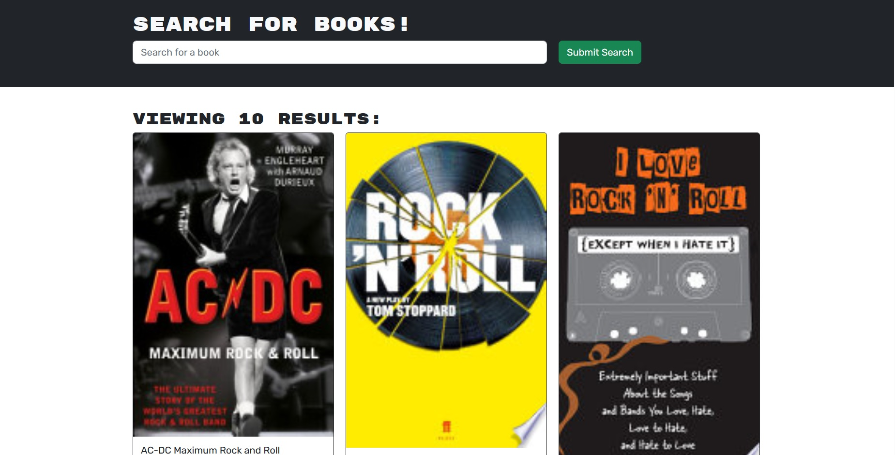

# book-app-mern-redux

## Description

The motivation behind this project was to practice and clarify concepts and understanding related to the use of the MERN stack, in particular ApolloServer and GraphQL by re-engineering an app with Restful architecture. This has required significant learning in the areas of GraphQl, ApolloServer, Heroku, MongoAtlas and more. While some errors remain persistent in the code it runs, meets requirements and generally makes me proud. This was not easily achieved and although it does require further refinement to be perfect, it will have to be revisited at a future date when I have more time.

## Table of Contents

- [Description](#description)
- [Usage](#usage)
- [Deployment](#deployment)
- [Credits](#credits)
- [License](#license)

## Installation

Once downloaded run npm i to install the required components, then run npm run develop to have the server run on local host.
Otherwise - view it in it's deployed form on Heroku.

## Usage

When the User visits the site they are greated by a searchbar and the option to login or signup. When they choose to login or signup a modal opens and accepts their details. This information is used to sign a token and is stored in the back end for future visits. 
The user can then search the website that retrieves books from the googlebooks API. When they save a book it can be viewed from the savedbooks page, that loads all of the books previously saved to the backend.
The user can also logout.

## Deployment

Screenshot:

The deployed application:
https://tranquil-escarpment-50545.herokuapp.com/

## Credits

This project makes use of code from the bootcamp activities, as well as starter code - although modified for this purpose.

It also makes use of nodeJS, ExpressJs, React, GraphQl, ApolloServer, and others (check the package for full list of dependencies).

The rest, aside from some help and bugfixes from my teachers, is my own work.

Credit to my teachers, as without them this would not have been possible.

## License

Licensed under the MIT license.

